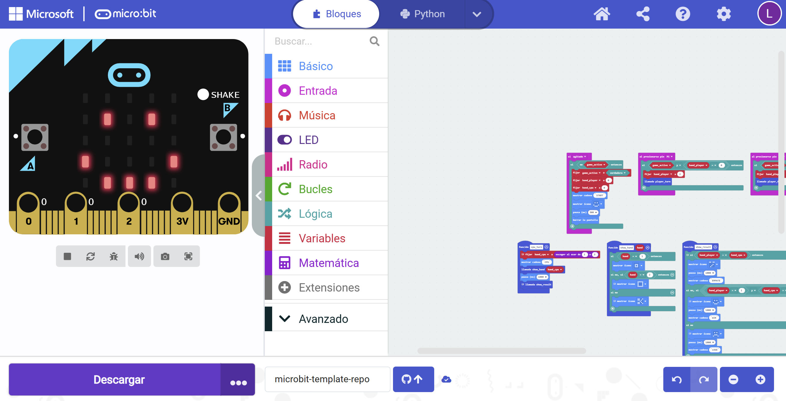

## Pedra, Paper o Tisora amb Micro:bit

Aquest programa et permet jugar a **Pedra, Paper o Tisora** contra la CPU utilitzant els pins del micro:bit.

## Com comença el joc?

Agita el micro:bit o prem el botó "Shake".
Apareixerà **START** i una icona feliç: això indica que el joc ha començat.

## Com es juga?

Tria la teva jugada prement un pin:

* **P0** → Tisora
* **P1** → Pedra
* **P2** → Paper

Primer es mostra la teva jugada, després la de la CPU.

## Quan acaba?

Després de comparar les jugades:

* Mostra si **has guanyat**, **perdut** o **empatat**.
* Apareix **END** i el joc es reinicia.

Per tornar a jugar, només cal **tornar a agitar** el micro:bit.

